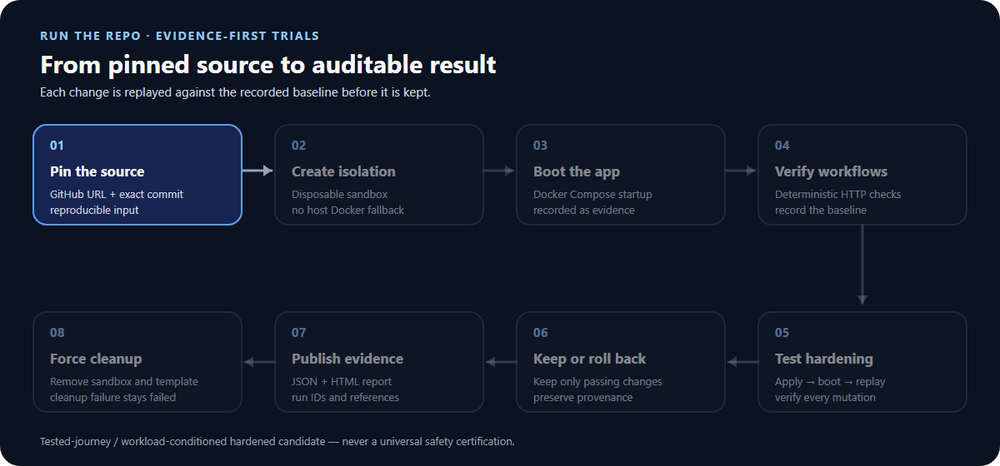

# RunTheRepo

**Run a repo. Verify what works. Test what can be hardened.**

Run GitHub Docker Compose apps in disposable sandboxes. Verify workflows,
test hardening, and get evidence-backed reports.

[Quick start](#quick-start) · [Usage guide](docs/dev/usage.md) · [Setup](docs/dev/wsl2-linux-sbx-setup.md) · [Validation results](docs/dev/release-closeout.md)

[中文 README](README.zh-CN.md) · English

> **0.1 Preview** — for pre-configured WSL2 + Docker Sandboxes environments.
> The CLI and Python package are named `repotrial`.

## How it works



Changes are kept only when the recorded baseline workflows pass again.
A cleanup failure remains a failed run—even if the sandbox inventory is empty.

## What you get

| Capability | Result |
| --- | --- |
| Commit-pinned trials | Know exactly which source version was tested |
| Deterministic HTTP checks | Check response status and content, including declared authenticated workflows |
| Tested hardening | Keep or roll back each change based on replayed checks |
| Usable outputs | JSON/HTML reports, evidence references and a cumulative hardened overlay when provenance is valid |
| Local console | Submit one trial, follow its status and open its report |

Hardening results apply **only to the tested workflows**, not to every feature
of an application. This is not a security certification.

## Real runs, not mockups

| Application | Verified workflow | Outcome |
| --- | --- | --- |
| Umami | Anonymous access rejection → login → create → read → delete → confirm absence | All 6 steps passed at baseline and after each of 2 kept changes |
| changedetection.io | HTTP `GET /` | Passed at baseline and after each of 2 kept changes |

Both runs produced reports and completed sandbox/template cleanup with empty
official inventory. Umami's workflow was **operator-authored**, not generated
by an LLM. These examples do not imply universal repository compatibility.

<details>
<summary>View the actual Umami report</summary>


Unmodified report viewport from run `e751fd28-94f9-4d90-9a3c-7aaa8f791b47`.
The report still uses the internal name RepoTrial.

</details>

[Exact commits, run IDs, failed cases and quality checks →](docs/dev/release-closeout.md)

## Quick start

**Before you begin:** use the distro's ext4 filesystem with Ubuntu 24.04 on
WSL2, systemd, accessible nested KVM and authenticated Docker Sandboxes
**v0.42.0** with the reviewed default-deny policy. Native Windows and host
Docker execution are not supported. Follow the [one-time setup guide](docs/dev/wsl2-linux-sbx-setup.md)
if these prerequisites are not ready.

From your checked-out project directory, with `uv` installed:

```bash
uv sync --locked --all-groups
uv run playwright install chromium
uv run repotrial doctor
```

Continue only when doctor reports `READY`. The setup guide covers browser OS
dependencies and proxy configuration.

### Local Web console

For model-assisted runs, first set the key in the same WSL Bash session:

```bash
read -rsp 'Model API key: ' REPOTRIAL_MODEL_API_KEY && echo
export REPOTRIAL_MODEL_API_KEY
uv run repotrial serve --port 8765
```

Open **http://127.0.0.1:8765/**, enter a public repository URL, its full commit
SHA and internal web port. Set your model endpoint/name when using a model.
The console is loopback-only and runs one trial at a time.

### CLI

Example target: Umami. Replace the model endpoint and name with your provider's
values; this command does not supply the authenticated workflow shown above.

```bash
uv run repotrial inspect https://github.com/umami-software/umami \
  --provider docker-sbx \
  --commit-sha ca661c7057984aa98ed4f7083d84dae2f65bfcb0 \
  --container-port 3000 \
  --compose-path docker-compose.yml \
  --model-endpoint https://MODEL-ENDPOINT/v1 \
  --model-name MODEL_NAME
```

Reports are written to `artifacts/<run_id>/report/`.
For your own HTTP checks, use [`--journeys-file`](docs/dev/usage.md#operator-authored-http-journeys).

## Preview boundaries

- **Isolation:** no host Docker fallback. Cleanup is fail-closed; CPU, memory,
  disk and host-side sandbox-duration bounds remain enforced.
- **PID limits:** the supported SBX runtime has no verified PID hard bound;
  fork-bomb protection is not claimed.
- **Coverage:** real-target browser workflows are unsupported. Accepted LLM
  contribution has not been demonstrated; operator-authored checks are not LLM evidence.
- **Installation:** tested on the supported existing WSL/SBX host, not a fresh OS.
- **Product scope:** no public resume or durable Web history; the default API
  container is not a ready-to-run sandbox service.
- **Credentials:** use disposable target test accounts only. Model keys stay
  in the process environment, never in a Journey file or the Web form.

## Documentation

| Need | Guide |
| --- | --- |
| Install WSL/SBX or fix connectivity | [Environment setup](docs/dev/wsl2-linux-sbx-setup.md) |
| Write HTTP checks, configure a model or troubleshoot | [Usage guide](docs/dev/usage.md) |
| Inspect validation evidence and known failures | [Release closeout](docs/dev/release-closeout.md) |
| Run development quality checks | [Development gates](docs/dev/usage.md#development-gates) |
