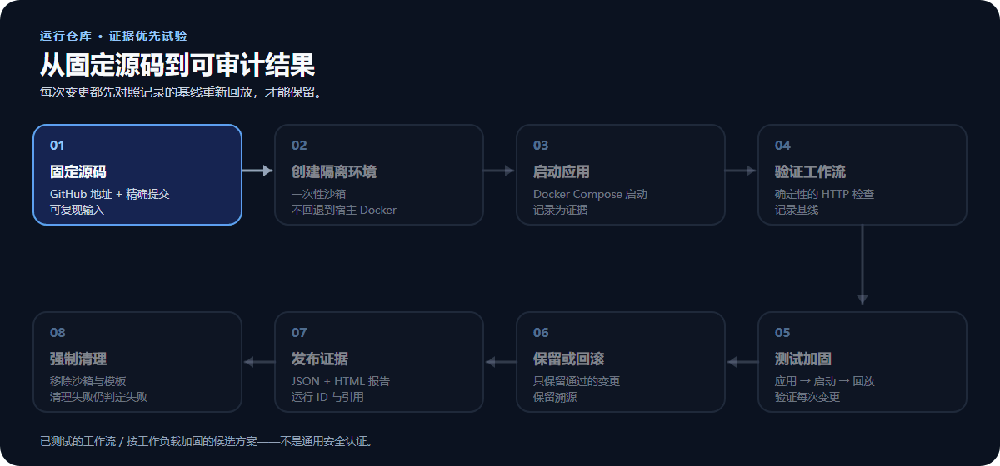
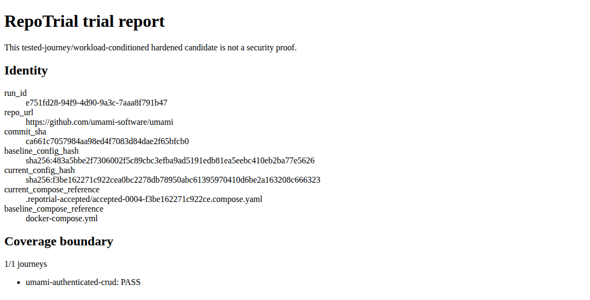

# RunTheRepo

**运行仓库。验证可用性。测试可加固性。**

在一次性沙箱中运行 GitHub Docker Compose 应用，验证工作流、测试加固，并生成有据可查的报告。

[快速开始](#快速开始) · [使用指南](docs/dev/usage.md) · [环境设置](docs/dev/wsl2-linux-sbx-setup.md) · [验证结果](docs/dev/release-closeout.md)

[English README](README.md) · 中文

> **0.1 Preview** — 面向预配置的 WSL2 + Docker Sandboxes 环境。
> CLI 和 Python 包名为 `repotrial`。

## 工作方式



只有在记录的基线工作流再次通过后，改动才会被保留。
即使沙箱清单为空，清理失败仍会使本次运行失败。

## 你将获得什么

| 能力 | 结果 |
| --- | --- |
| 固定提交的试跑 | 明确知道测试的是哪一个源代码版本 |
| 确定性的 HTTP 检查 | 检查响应状态和内容，包括已声明的认证工作流 |
| 经过测试的加固 | 根据重放后的检查结果保留或回滚每项改动 |
| 可用的输出 | JSON/HTML 报告、证据引用，以及在来源有效时生成的累计加固 overlay |
| 本地控制台 | 提交一次试跑、跟踪状态并打开报告 |

加固结果**仅适用于已测试的工作流**，不代表应用的所有功能。
这不是安全认证。

## 真实运行，不是演示模型

| 应用 | 已验证工作流 | 结果 |
| --- | --- | --- |
| Umami | 匿名访问拒绝 → 登录 → 创建 → 读取 → 删除 → 确认不存在 | 基线以及之后保留的 2 项改动均通过全部 6 个步骤 |
| changedetection.io | HTTP `GET /` | 基线以及之后保留的 2 项改动均通过 |

两次运行都生成了报告，并完成沙箱/模板清理，官方清单为空。Umami 的工作流由**操作员编写**，不是由 LLM 生成。这些示例不代表对所有仓库都兼容。

<details>
<summary>查看实际的 Umami 报告</summary>



来自运行 `e751fd28-94f9-4d90-9a3c-7aaa8f791b47` 的未修改报告视图。
报告仍使用内部名称 RepoTrial。

</details>

[精确提交、运行 ID、失败案例和质量检查 →](docs/dev/release-closeout.md)

## 快速开始

**开始前：** 使用 Ubuntu 24.04 的发行版 ext4 文件系统、WSL2、systemd、可用的嵌套 KVM，以及配置了经审核的默认拒绝策略的认证 Docker Sandboxes **v0.42.0**。不支持原生 Windows 和宿主机 Docker 执行。如果这些前置条件尚未准备好，请先阅读[一次性设置指南](docs/dev/wsl2-linux-sbx-setup.md)。

在已检出的项目目录中，并确保已安装 `uv`：

```bash
uv sync --locked --all-groups
uv run playwright install chromium
uv run repotrial doctor
```

只有当 doctor 报告 `READY` 后才能继续。设置指南包含浏览器操作系统依赖和代理配置说明。

### 本地 Web 控制台

进行模型辅助运行时，先在同一个 WSL Bash 会话中设置密钥：

```bash
read -rsp 'Model API key: ' REPOTRIAL_MODEL_API_KEY && echo
export REPOTRIAL_MODEL_API_KEY
uv run repotrial serve --port 8765
```

打开 **http://127.0.0.1:8765/**，输入公开仓库 URL、完整提交 SHA 和内部 Web 端口。使用模型时设置模型端点/名称。控制台仅监听回环地址，并且一次只运行一个试跑。

### CLI

示例目标：Umami。将模型端点和名称替换为你的服务商值；此命令不提供上文展示的认证工作流。

```bash
uv run repotrial inspect https://github.com/umami-software/umami \
  --provider docker-sbx \
  --commit-sha ca661c7057984aa98ed4f7083d84dae2f65bfcb0 \
  --container-port 3000 \
  --compose-path docker-compose.yml \
  --model-endpoint https://MODEL-ENDPOINT/v1 \
  --model-name MODEL_NAME
```

报告写入 `artifacts/<run_id>/report/`。
如需自定义 HTTP 检查，请使用 [`--journeys-file`](docs/dev/usage.md#operator-authored-http-journeys)。

## Preview 边界

- **隔离：** 不回退到宿主机 Docker。清理采用失败即关闭策略；CPU、内存、磁盘和宿主侧沙箱时长限制仍然有效。
- **PID 限制：** 当前支持的 SBX 运行时没有经过验证的 PID 硬上限；不宣称具备 fork bomb 防护。
- **覆盖范围：** 真实目标的浏览器工作流不受支持。尚未证明 LLM 贡献被接受；操作员编写的检查不是 LLM 证据。
- **安装：** 已在支持的现有 WSL/SBX 主机上测试，不代表全新操作系统上的安装结果。
- **产品范围：** 没有公开的恢复或持久化 Web 历史；默认 API 容器不是开箱即用的沙箱服务。
- **凭据：** 仅使用一次性的目标测试账户。模型密钥只保留在进程环境中，不写入 Journey 文件或 Web 表单。

## 文档

| 需求 | 指南 |
| --- | --- |
| 安装 WSL/SBX 或排查连接问题 | [环境设置](docs/dev/wsl2-linux-sbx-setup.md) |
| 编写 HTTP 检查、配置模型或排查问题 | [使用指南](docs/dev/usage.md) |
| 查看验证证据和已知失败 | [Release closeout](docs/dev/release-closeout.md) |
| 运行开发质量检查 | [开发门禁](docs/dev/usage.md#development-gates) |
